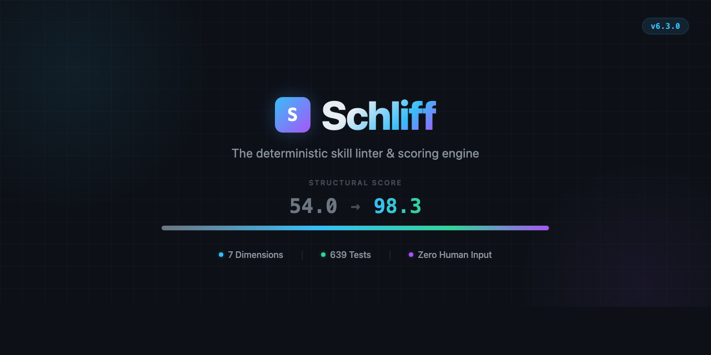
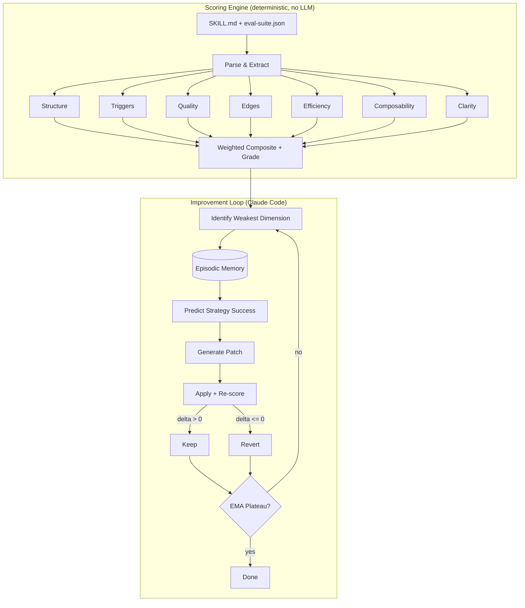

<p align="center">
  
</p>

<h3 align="center">The deterministic skill linter & scoring engine for Claude Code</h3>

<p align="center">
  <i>schliff</i> (German) — the finishing cut. <i>"Den letzten Schliff geben"</i> = to give something its final polish.
</p>

<p align="center">
  <a href="https://github.com/Zandereins/schliff"></a>
  <a href="skills/schliff/scripts/score-skill.py"></a>
  <a href=".github/workflows/test.yml"></a>
  <a href="LICENSE"></a>
  <a href="CHANGELOG.md"></a>
</p>

---

Schliff is a **rule-based linter and scoring engine** for [Claude Code skills](https://docs.anthropic.com/en/docs/claude-code/skills). It measures skill quality across 7 dimensions using deterministic static analysis — no LLM required for scoring. The autonomous improvement loop then uses Claude Code to apply patches, measure deltas, and revert regressions.

```
pip install schliff
schliff score path/to/SKILL.md
```

```
schliff v6.1.0

  structure      ██████████  100/100  perfect
  triggers       ██████████   97/100  excellent
  quality        █████████░   91/100  great
  edges          ██████████  100/100  perfect
  efficiency     ████████░░   83/100  good
  composability  ██████████  100/100  perfect
  clarity        ██████████  100/100  perfect

  Structural Score  ███████████████████░  95.7/100  [S]
  → 1 deterministic fixes available. Run `schliff auto` to apply.
```

---

## Why Schliff

**Deterministic scoring, not LLM guessing.** The scorer is pure Python — same input, same output, every time. 40+ pre-compiled regex patterns, TF-IDF keyword analysis, suffix-stripping stemmer, contradiction detection. No API calls, no tokens burned, no variance between runs.

**7-dimension analysis with anti-gaming.** Structure, trigger accuracy, eval coverage, edge cases, token efficiency, composability, clarity — each with sub-checks that can't be inflated by padding. Empty headers don't count. Repetitive markers get capped. Coherence bonus rewards actual instruction-assertion alignment, not keyword stuffing.

**Cross-session episodic memory.** Schliff remembers which improvement strategies worked across sessions. TF-IDF semantic search over a local JSONL store. Your 50th skill improves faster than your 1st because the system predicts strategy success probability before trying.

---

## How it differs from autoresearch

Inspired by [Karpathy's autoresearch](https://github.com/karpathy/autoresearch) — but Schliff is not a clone. autoresearch optimizes ML training scripts against a single loss metric using 100% LLM-generated patches. Schliff is a **linter** that happens to have an auto-fix mode.

| | autoresearch (Karpathy) | autoresearch (uditgoenka) | Schliff |
|---|---|---|---|
| **Target** | ML training scripts | Generalized research | Claude Code SKILL.md files |
| **Patch strategy** | 100% LLM-generated | 100% LLM-generated | 60-70% deterministic rules, 30-40% LLM |
| **Scoring** | 1 metric (val_bpb) | 1 metric (configurable) | 7 dimensions + optional runtime |
| **Anti-gaming** | None | None | Empty-header detection, signal caps, coherence checks |
| **Memory** | Stateless | Stateless | Cross-session episodic store with TF-IDF recall |
| **Fleet analysis** | Single file | Single file | 50+ skills via MinHash+LSH mesh in O(n) |
| **Dependencies** | Heavy (PyTorch, etc.) | Claude Code | Python 3.9+ stdlib only |
| **Tests** | Minimal | Minimal | 540+ (unit + integration + proof + stress) |
| **CI integration** | None | None | GitHub Action with PR score comments |

The core difference: autoresearch is a research loop. Schliff is a **measurement tool** with an optional auto-fix mode. You can run `schliff score` in CI without ever touching the improvement loop.

---

## Quick Start

### Score a skill (no Claude Code needed)

```bash
pip install schliff
schliff score path/to/SKILL.md
schliff score path/to/SKILL.md --json   # machine-readable output
schliff doctor                           # scan all installed skills
```

### Autonomous improvement (requires Claude Code)

```bash
# Install the Claude Code commands
git clone https://github.com/Zandereins/schliff.git && bash schliff/install.sh

# Inside Claude Code:
/schliff:init path/to/SKILL.md    # bootstrap eval suite + baseline
/schliff:auto                      # autonomous loop: patch, measure, keep or revert
```

The demo skill goes from 54 [D] to 98.3 [S] in 18 iterations, zero human input.

**Prerequisites:** Python 3.9+, Bash, Git, jq

---

## Real-World Results

| Skill | Before | After | Iterations | Author |
|-------|--------|-------|------------|--------|
| schliff (self-score) | 54.0 | 98.3 | 18 | [@Zandereins](https://github.com/Zandereins) |
| agent-review-panel | 89.1 | 90.8 | 8 | [@wan-huiyan](https://github.com/wan-huiyan) |

*Want to add your skill? Run `schliff score`, then [open a PR](https://github.com/Zandereins/schliff/edit/main/README.md).*

---

## Commands

### Core

| Command | Purpose |
|---------|---------|
| `/schliff` | Full autonomous loop with custom GOAL + METRIC |
| `/schliff:auto` | Self-driving improvement — deterministic patches, EMA-based stopping |
| `/schliff:init` | Bootstrap eval suite + baseline from any SKILL.md |
| `/schliff:doctor` | Scan all installed skills, show health grades + token costs |
| `/schliff:report` | Generate shareable markdown report with badge |

### CI

| Command | Purpose |
|---------|---------|
| `schliff verify <path>` | CI gate — exit 0 if pass, exit 1 if fail or regression |
| `schliff verify <path> --min-score 85` | Custom threshold |
| `schliff verify <path> --regression` | Fail if score dropped vs previous run |

### Analyze

| Command | Purpose |
|---------|---------|
| `/schliff:analyze` | One-shot gap analysis with ranked fix recommendations |
| `/schliff:bench` | Establish quality baseline |
| `/schliff:eval` | Run eval suite assertions (structural + optional runtime) |
| `/schliff:mesh` | Detect trigger conflicts across all installed skills |
| `/schliff:triage` | Cluster logged failures, auto-generate fixes |
| `/schliff:log-failure` | Record a skill failure for later triage |
| `/schliff:update` | Update Schliff to latest version |

---

## Scoring

Two tiers. One decision.

**Structural (default)** — Static analysis. No LLM. Instant. Measures file organization, not runtime effectiveness. A skill with 99/100 structure can still fail at runtime. This is the lint score.

**Runtime (opt-in, `--runtime`)** — Invokes Claude with test prompts, validates assertions against actual output. This is the quality gate. Requires `claude` CLI.

| Dimension | Weight | Measures |
|-----------|--------|---------|
| Structure | 15% | Frontmatter, headers, examples, progressive disclosure, dead content |
| Trigger Accuracy | 20% | TF-IDF keyword overlap with stemming, synonym expansion, negation boundaries |
| Eval Coverage | 20% | Assertion diversity, feature coverage, instruction-assertion coherence |
| Edge Coverage | 15% | Edge case categories (minimal, invalid, scale, malformed, unicode), expected behaviors |
| Token Efficiency | 10% | Signal-to-noise density via sqrt curve, hedging/filler detection |
| Composability | 10% | 10 sub-checks: scope, state, I/O, handoffs, errors, idempotency, deps, namespace |
| Clarity | 5% | Contradictions, vague references, ambiguous pronouns, incomplete instructions |
| Runtime | 10% | *(opt-in)* Actual Claude behavior against `response_*` assertions |

Grades: **S** (>=95) / **A** (>=85) / **B** (>=75) / **C** (>=65) / **D** (>=50) / **E** (>=35) / **F** (<35)

Weights are auto-calibrated from runtime data or overridden via `--weights "triggers=0.4,structure=0.3"`. Full methodology: [docs/SCORING.md](docs/SCORING.md)

---

## Anti-Gaming Detection

Schliff catches common score-inflation patterns:

| Gaming Attempt | Detection | Score Impact |
|----------------|-----------|-------------|
| Empty headers (structure inflation) | Header content check | Penalized |
| Keyword stuffing (trigger inflation) | Dedup + frequency cap | Penalized |
| Copy-paste examples | Repeated-line detection | 94 -> 43 |
| Contradictory instructions | always/never contradiction finder | Flagged |
| Bloated preamble | Signal-to-noise ratio | Penalized |
| Missing scope boundaries | 10 composability sub-checks | Penalized |

6/6 gaming attempts detected in the benchmark suite. Run `python benchmarks/anti-gaming/run.py` to reproduce.

---

## Architecture



The scorer is the ruler. Claude is the craftsman. 60-70% of patches follow deterministic rules (frontmatter fixes, noise removal, TODO cleanup, hedging elimination). The LLM handles the remaining 30-40% — structural reorganization, example generation, edge case synthesis.

---

## GitHub Action

The Codecov for SKILL.md files. Score skills in CI, block regressions, comment on PRs.

```yaml
- uses: Zandereins/schliff@v6
  with:
    skill-path: '.claude/skills/my-skill/SKILL.md'
    minimum-score: '75'
    comment-on-pr: 'true'
```

---

## Results

The included demo skill (`demo/bad-skill/SKILL.md`) — a vague, hedging-filled deployment helper:

```
Baseline:   █████░░░░░░░░░░░░░░░  54.0/100  [D]
After 18x:  ████████████████████  98.3/100  [S]

  Structure         70 → 100     Frontmatter, examples, concrete commands
  Efficiency        35 → 93      Hedging removed, information density up
  Composability     30 → 90      Scope boundaries, error behavior, deps
  Clarity           90 → 100     Vague references resolved
```

18 iterations. Zero human input. Stops when EMA-based ROI detection hits plateau. Real-world skills vary — complex skills plateau around [A] to [S] depending on eval suite coverage.

---

## Quality

Schliff scores itself. Same engine, no exceptions.

| Metric | Value |
|--------|-------|
| Structural Score | 98.3/100 [S] |
| Tests | 540+ passing (unit + integration + benchmark + stress) |
| Security fixes | 40 (shell injection, prompt injection, ReDoS, supply chain) |
| Dependencies | Zero (Python 3.9+ stdlib only) |
| Python support | 3.9 - 3.13 |

---

## Ecosystem

`skill-creator` builds a v1 skill. Schliff grinds it to production quality.

```
skill-creator  -->  v1 SKILL.md  -->  schliff score  -->  /schliff:auto  -->  ship
```

---

## Badge

```markdown
[![Schliff: 95 [S]](https://img.shields.io/badge/Schliff-95%2F100_%5BS%5D-brightgreen)](https://github.com/Zandereins/schliff)
```

[![Schliff: 95 [S]](https://img.shields.io/badge/Schliff-95%2F100_%5BS%5D-brightgreen)](https://github.com/Zandereins/schliff)

---

## Contributing

Found a scoring bug? Add a test case and open an issue.
Want to improve scoring logic? Edit the relevant `scoring/*.py` module, run `bash scripts/test-integration.sh`, and PR the diff.

## License

MIT

---

*Built by [Franz Paul](https://github.com/Zandereins) with Claude Code.*
