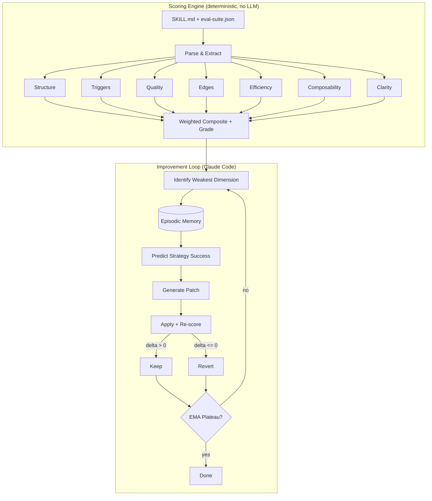

# Schliff

**Claude Code skills degrade silently.** A skill that worked last month misfires today — triggers overlap, instructions contradict, edge cases slip through. You don't notice until production. Schliff catches that before your users do.

```bash
pip install schliff
schliff score path/to/SKILL.md
```

<p align="center">
  
</p>

<p align="center">
  <a href="https://github.com/Zandereins/schliff"></a>
  <a href="skills/schliff/scripts/score-skill.py"></a>
  <a href=".github/workflows/test.yml"></a>
  <a href="LICENSE"></a>
  <a href="CHANGELOG.md"></a>
</p>

```
schliff v6.2.0

  structure      ██████████  100/100  perfect
  triggers       ██████████  100/100  perfect
  quality        ██████████   99/100  excellent
  edges          ██████████  100/100  perfect
  efficiency     █████████░   92/100  great
  composability  ██████████  100/100  perfect
  clarity        ██████████  100/100  perfect

  Structural Score  ████████████████████  99.0/100  [S]  (structural)
```

Schliff scores itself at 99.0/100 [S] structural. Same engine, no exceptions. **Zero dependencies** — Python 3.9+ stdlib only.

---

## Scoring

Deterministic static analysis. No LLM required. Same input, same output, every time.

| Dimension | Weight | What it catches |
|-----------|--------|-----------------|
| structure | 15% | Missing frontmatter, empty headers, no examples, dead content |
| triggers | 20% | TF-IDF keyword overlap, negation boundaries, precision/recall |
| quality | 20% | Thin assertions, missing feature coverage, low coherence |
| edges | 15% | No edge cases defined, missing categories (invalid, scale, unicode) |
| efficiency | 10% | Hedging, filler words, repetition, low signal-to-noise |
| composability | 10% | Missing scope boundaries, no error behavior, no handoff points |
| clarity | 5% | Contradictions, vague references, ambiguous instructions |
| runtime | 10% | *(opt-in)* Actual Claude behavior against eval assertions |

Weights are renormalized across measured dimensions (sum to 1.0). Without `--runtime`, the 7 structural dimensions carry 100% of the score.

Grades: **S** (>=95) / **A** (>=85) / **B** (>=75) / **C** (>=65) / **D** (>=50) / **E** (>=35) / **F** (<35)

Override weights: `--weights "triggers=0.4,structure=0.3"`. Full methodology: [docs/SCORING.md](docs/SCORING.md)

---

## Anti-Gaming

Schliff detects score inflation. 6/6 gaming attempts caught in the [benchmark suite](benchmarks/anti-gaming/).

| Gaming attempt | How Schliff catches it |
|----------------|----------------------|
| Empty headers (inflate structure) | Header content check — empty sections penalized |
| Keyword stuffing (inflate triggers) | Dedup + frequency cap on repeated terms |
| Copy-paste examples | Repeated-line detection — score drops 94 → 43 |
| Contradictory instructions | "always X" vs "never X" contradiction finder |
| Bloated preamble | Signal-to-noise ratio via sqrt density curve |
| Missing scope boundaries | 10 composability sub-checks, not a single binary |

Reproduce: `python benchmarks/anti-gaming/run.py`

---

## Quick Start

### Score any skill (no Claude Code needed)

```bash
pip install schliff          # or: pipx install schliff
schliff demo                            # see it in action instantly
schliff doctor                           # scan YOUR installed skills — prepare for surprises
schliff score path/to/SKILL.md          # score any specific skill
schliff score path/to/SKILL.md --json   # machine-readable
```

### Autonomous improvement (requires Claude Code)

```bash
git clone https://github.com/Zandereins/schliff.git && bash schliff/install.sh

# Inside Claude Code:
/schliff:init path/to/SKILL.md    # bootstrap eval suite + baseline
/schliff:auto                      # patch → measure → keep or revert → repeat
```

**Prerequisites:** Python 3.9+, Bash, Git, jq

---

## Results

| Skill | Before | After | Iterations | Author |
|-------|--------|-------|------------|--------|
| demo skill (`demo/bad-skill/`) | 54.0 [D] | 98.3 [S] | 18 | [@Zandereins](https://github.com/Zandereins) |
| agent-review-panel | 64.0 [D] | 85.6 [A] | 3 rounds | [@wan-huiyan](https://github.com/wan-huiyan) |

The demo skill — a vague, hedging-filled deployment helper — goes from [D] to [S] in 18 autonomous iterations:

```
  structure         70 → 100     Frontmatter, examples, concrete commands
  triggers           0 → 100     Description keywords, negative boundaries
  quality            0 → 95      Eval suite generated, assertions added
  edges              0 → 100     Edge cases synthesized
  efficiency        35 → 93      Hedging removed, information density up
  composability     30 → 90      Scope boundaries, error behavior, deps
  clarity           90 → 100     Vague references resolved
```

Real-world skills vary. Complex skills plateau around [A] to [S] depending on eval suite coverage.

*Run `schliff score` on your skill and [add your result](https://github.com/Zandereins/schliff/edit/main/README.md).*

### Community

> "It's become a core part of my skill development workflow!" — [@wan-huiyan](https://github.com/wan-huiyan)

[@wan-huiyan](https://github.com/wan-huiyan) used schliff to improve [agent-review-panel](https://github.com/wan-huiyan/claude-client-proposal-slide) from 64 to 85.6 across three rounds. Along the way, SKILL.md went from 1,331 to 340 lines — a 75% token reduction via `references/` extraction. A/B testing on a 1,132-line document confirmed identical review quality with fewer tokens.

---

## Commands

| Command | Purpose |
|---------|---------|
| `schliff demo` | Score a built-in bad skill — see schliff in action instantly |
| `schliff score <path>` | Score a SKILL.md (pip CLI, no Claude Code needed) |
| `schliff verify <path>` | CI gate — exit 0/1, `--min-score`, `--regression`, pre-commit hook |
| `schliff doctor` | Scan all installed skills, show health grades |
| `schliff badge <path>` | Generate copy-paste markdown badge |
| `/schliff:auto` | Autonomous improvement loop with EMA-based stopping |
| `/schliff:init <path>` | Bootstrap eval suite + baseline from any SKILL.md |
| `/schliff:analyze` | One-shot gap analysis with ranked fix recommendations |
| `/schliff:mesh` | Detect trigger conflicts across all installed skills |
| `/schliff:report` | Generate shareable markdown report with badge |

---

## CI Integration

Score skills in CI. Block regressions. The Codecov for SKILL.md files.

```yaml
# GitHub Action
- uses: Zandereins/schliff@v6
  with:
    skill-path: '.claude/skills/my-skill/SKILL.md'
    minimum-score: '75'
    comment-on-pr: 'true'
```

```bash
# Or use the CLI directly
schliff verify path/to/SKILL.md --min-score 75 --regression
```

---

## Pre-commit Hook

```yaml
# .pre-commit-config.yaml
repos:
  - repo: https://github.com/Zandereins/schliff
    rev: v6.2.0
    hooks:
      - id: schliff-verify
        args: ['--min-score', '75']
```

---

## How it differs from autoresearch

Inspired by [Karpathy's autoresearch](https://github.com/karpathy/autoresearch) — but Schliff is a **linter**, not a research loop. You can run `schliff score` in CI without ever touching the improvement loop.

| | autoresearch | Schliff |
|---|---|---|
| **Target** | ML training scripts | Claude Code SKILL.md files |
| **Patches** | 100% LLM-generated | 60-70% deterministic rules, 30-40% LLM |
| **Scoring** | 1 metric | 7 dimensions + optional runtime |
| **Anti-gaming** | None | 6 detection vectors |
| **Memory** | Stateless | Cross-session episodic store |
| **Dependencies** | External (ML frameworks) | Python 3.9+ stdlib only |
| **Tests** | Minimal | 500+ |

---

<details>
<summary><b>Architecture</b> — How the scoring engine and improvement loop connect (<a href="https://github.com/Zandereins/schliff">view diagram on GitHub</a>)</summary>

The scorer is the ruler. Claude is the craftsman.



*Note: Mermaid diagram renders on GitHub. On PyPI, view the [repository](https://github.com/Zandereins/schliff) for the visual.*

60-70% of patches follow deterministic rules (frontmatter fixes, noise removal, TODO cleanup, hedging elimination). The LLM handles the remaining 30-40% — structural reorganization, example generation, edge case synthesis.
</details>

---

## Limitations

The structural score measures **file organization**, not runtime effectiveness. A skill scoring 95/100 structurally can still produce wrong output at runtime — use `--runtime` scoring for that.

The trigger scorer uses TF-IDF heuristics. Skills whose domain vocabulary overlaps with generic terms (e.g., "review", "analyze") may hit a precision ceiling around 75-80. [Precision/recall reporting](skills/schliff/scripts/scoring/triggers.py) helps diagnose this.

---

## Ecosystem

```
skill-creator  -->  v1 SKILL.md  -->  schliff score  -->  /schliff:auto  -->  ship
```

Anthropic's [skill-creator course](https://github.com/anthropics/courses/tree/master/claude-code/09-skill-creator) teaches you to build a v1 skill. Schliff grinds it to production quality.

---

## Badge

```markdown
[![Schliff: 99 [S]](https://img.shields.io/badge/Schliff-99%2F100_%5BS%5D-brightgreen)](https://github.com/Zandereins/schliff)
```

[![Schliff: 99 [S]](https://img.shields.io/badge/Schliff-99%2F100_%5BS%5D-brightgreen)](https://github.com/Zandereins/schliff)

---

## Contributing

Found a scoring bug? Add a test case and [open an issue](https://github.com/Zandereins/schliff/issues).
Want to improve scoring logic? Edit the relevant `scoring/*.py`, run `bash scripts/test-integration.sh`, PR the diff.

## License

MIT

---

*schliff (German) — the finishing cut. "Den letzten Schliff geben" = to give something its final polish.*
*Built by [Franz Paul](https://github.com/Zandereins) with Claude Code.*
